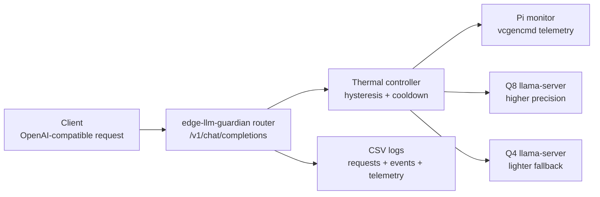
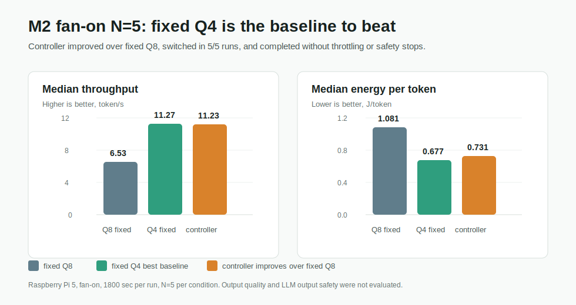

# edge-llm-guardian

Thermal-aware OpenAI-compatible LLM router for Raspberry Pi 5.

`edge-llm-guardian` routes chat requests between Q8 and Q4 `llama.cpp`
servers based on Raspberry Pi thermal state. It is a small systems project for
measuring what happens when local LLM inference meets real edge-device limits:
temperature, throttling, memory, latency, and energy per token.

## Overview

The project runs two local model servers:

- Q8: higher-precision, heavier inference path
- Q4: lighter fallback path

The router exposes an OpenAI-compatible `/v1/chat/completions` endpoint. A
controller reads Raspberry Pi telemetry and selects Q8 or Q4 using hysteresis
and cooldown rules. Every request and controller decision is written to CSV so
the behavior can be inspected after a run.

The main result is intentionally conservative:

> For this workload, fixed Q4 was the best baseline. The controller's value
> appeared against fixed Q8: it improved median throughput by 72% and reduced
> J/token by 32%, while recording switch events in 5/5 controller runs with no
> throttling or safety stops.

This does not mean the controller is always better. It means the thermal
control path worked on real hardware, and the experiment identified where a
simple Q4 baseline is still stronger.

## Why This Exists

Small edge devices can run local LLMs, but they do not behave like desktop
GPUs. Under sustained load, temperature and power delivery become part of the
system design.

This project asks:

- Can a Raspberry Pi 5 run two quantized LLM backends and switch between them?
- Can the switch be exposed through an OpenAI-compatible API?
- Can the system record enough evidence to compare fixed Q8, fixed Q4, and a
  thermal controller?
- If always using Q4 is not acceptable for a future quality-sensitive workload,
  is there a measured fallback path that is better than staying on fixed Q8?

Output quality and LLM output safety are not evaluated yet. Those are future
workloads, not claims made by this repository.

## Architecture



## Evaluation Result

Fan-on Raspberry Pi 5 run, 30 minutes per run, N=5 per condition.



| condition | median token/s | median J/token | median tokens | median max temp | throttle | safety stop |
| --- | ---: | ---: | ---: | ---: | --- | --- |
| `q8_fixed` | 6.53 | 1.081 | 11772 | 65.3 C | false | false |
| `q4_fixed` | 11.27 | 0.677 | 20550 | 68.1 C | false | false |
| `controller` | 11.23 | 0.731 | 18504 | 68.1 C | false | false |

What worked:

- Raspberry Pi 5 ran Q8 and Q4 `llama-server` backends.
- The router accepted OpenAI-compatible chat requests.
- The controller switched from Q8 to Q4 and back in 5/5 controller runs.
- All selected runs completed with `throttle_seen=false` and
  `safety_stop=false`.
- The run produced request, telemetry, event, manifest, and power-summary CSV
  evidence.

What the experiment showed:

- Fixed Q4 was the best baseline for this simple workload.
- The controller improved over fixed Q8:
  - median token/s: `6.53 -> 11.23` (+72%)
  - median J/token: `1.081 -> 0.731` (-32%)
- The controller did not outperform fixed Q4 on latency, token/s, or J/token.

What this does not prove:

- Output quality was not evaluated.
- LLM output safety was not evaluated.
- The `63/59 C` thresholds are not claimed to be optimal.
- Fan-off long-run stability is not claimed.
- The result is not a claim that the controller is generally better than fixed
  Q4.

Full evidence summary: [`docs/m2_full_fan_on_n5_results.md`](docs/m2_full_fan_on_n5_results.md)

## How It Works

The controller is a two-state policy:

- use Q8 while the device is cool enough
- switch to Q4 when temperature crosses the upper threshold
- switch back to Q8 only after the lower threshold is reached
- block rapid switching with a cooldown window

The key pieces are:

- `monitor.py`: reads Raspberry Pi temperature, clock, and throttling status
- `controller.py`: chooses Q8 or Q4 with hysteresis and cooldown
- `router.py`: accepts OpenAI-compatible requests and forwards them upstream
- `logger.py`: writes request and event CSV rows
- `m0.py`, `m1.py`, `m2.py`: experiment helpers for bring-up, switch checks, and
  comparison runs

## Running Locally

Local runs use fake backends and do not require a Raspberry Pi.

```bash
python -m pip install -e ".[dev]"
python -m pytest
```

Start fake Q8 and Q4 servers:

```bash
python scripts/fake_llama_server.py --port 8081 --name q8
python scripts/fake_llama_server.py --port 8082 --name q4
```

Run the router:

```bash
python -m edge_llm_guardian.router --config config.example.json
```

Dry-run mode does not contact a backend:

```bash
python -m edge_llm_guardian.router --config config.example.json --dry-run
```

## Running On Raspberry Pi

Local Pi configuration files are intentionally ignored by git. Copy the example
configs and fill in local model paths and ports:

```bash
cp m0.example.json m0.local.json
cp m2.example.json m2.local.json
cp config.m2.fan_on.example.json config.m2.fan_on.local.json
```

Start and check Q8/Q4 servers:

```bash
python -m edge_llm_guardian.m0 start --config m0.local.json
python -m edge_llm_guardian.m0 check --config m0.local.json
python -m edge_llm_guardian.m0 chat-smoke \
  --config m0.local.json \
  --output data/m0/YYYY-MM-DD/chat_smoke.csv
```

Run an M2 comparison condition:

```bash
python -m edge_llm_guardian.m2 run \
  --config m2.local.json \
  --mode controller \
  --output-dir data/m2/YYYY-MM-DD/fan_on_full/controller_001 \
  --duration-sec 1800 \
  --cooling fan_on \
  --prompt-id-prefix m2-full
```

Join manual USB power-meter readings with run summaries:

```bash
python -m edge_llm_guardian.m2 power-summary \
  --manual-power data/m2/YYYY-MM-DD/fan_on_full/manual_power_readings.csv \
  --input data/m2/YYYY-MM-DD/fan_on_full/q8_fixed_001 \
  --input data/m2/YYYY-MM-DD/fan_on_full/q4_fixed_001 \
  --input data/m2/YYYY-MM-DD/fan_on_full/controller_001 \
  --output data/m2/YYYY-MM-DD/fan_on_full/power_summary.csv
```

## Evidence

Tracked docs summarize the evidence without committing raw experiment outputs:

- [`docs/evidence_log.md`](docs/evidence_log.md)
- [`docs/m2_full_protocol.md`](docs/m2_full_protocol.md)
- [`docs/m2_full_fan_on_n5_results.md`](docs/m2_full_fan_on_n5_results.md)
- [`DECISIONS.md`](DECISIONS.md)

Raw CSVs, USB meter photos, local configs, model paths, and archives stay out of
git under ignored paths such as `data/` and `*.local.json`.

## Limitations

- The current evaluation uses one simple prompt workload.
- Output quality was not evaluated.
- LLM output safety was not evaluated.
- Q4 was the best baseline in the measured workload.
- Controller thresholds were chosen for the fan-on evaluation and are not
  claimed to be optimal.
- Fan-off long-run evaluation is intentionally not included; an earlier no-fan
  run reached a thermal safety stop.

## Repository Map

```text
src/edge_llm_guardian/
  monitor.py      Raspberry Pi telemetry wrappers
  controller.py   Q8/Q4 thermal state machine
  router.py       OpenAI-compatible forwarding API
  logger.py       CSV request/event logging
  m0.py           real-model bring-up helpers
  m1.py           switch-event load and analysis helpers
  m2.py           fixed-workload comparison helpers

docs/
  m2_full_fan_on_n5_results.md   completed N=5 evidence summary
  m2_full_protocol.md            full evaluation protocol
  evidence_log.md                checked facts and safe wording
```
